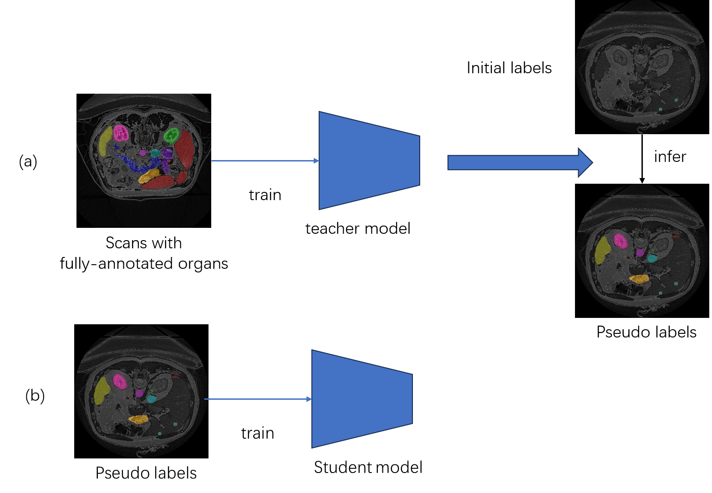

# FLARE23 Solution

This repository contains our solution "Iterative Semi-Supervised Learning for Abdominal Organs and Tumor Segmentation" for the FLARE23 challenge, based on nnU-Netv2.

## 🔍 Overview

Our approach is based on interative SSL, which employs a multi-stage pseudo-labeling method to tackle the issue of partial labels for organs and tumors in the FLARE23 dataset. For more details, see the pipeline diagram below:



## ⚙️ Environment Setup

To set up the environment, follow these steps:

```
conda create -n FLARE23
conda activate FLARE23
```
Then make sure to install PyTorch 2 compatible with your CUDA version.
```
pip install -e .
```

## ⬇️ Download Checkpoints

Download the checkpoints and pseudo labels from [BaiduNetDisk](https://pan.baidu.com/s/1yFmK8WZifE-EhFQTcfsYtA?pwd=1111 ). Code：1111

## 🚀 Ensemble Pseudo labels

```
python ensemble.py
```

The 'ensemble.py' is in the process directory. You SHOULD modify your defined paths of pseudo labels first!

## 🚀 Inference

1. Place your input images in the `./inputs` directory.
2. Run the prediction script:

```
sh predict.sh
```

This will generate the output in the `./outputs` directory.

Or you can follow the innstructions of nnunetv2 to predict. they are equal.

More details are coming!
